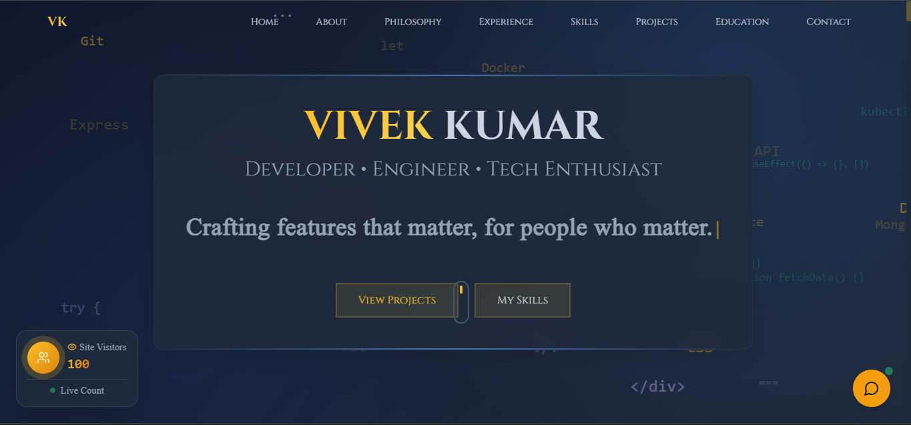

# Vivek Kumar  
### Full-Stack Software Engineer | I build modern web applications that are fast, reliable, and built to last.

A modern, full-stack portfolio website built with Next.js, featuring real-time visitor analytics, an AI-powered chatbot, and a showcase of my projects, skills, and experience. Designed for performance, accessibility, and a beautiful user experience.



---

## ✨ Features

- **About Me**: Learn about my background, philosophy, and journey.
- **Skills & Experience**: Detailed overview of my technical skills and professional experience.
- **Projects**: Interactive cards highlighting my best work, with live demos and code links.
- **AI Chatbot**: Ask questions about my skills, experience, or anything else—powered by AI.
- **Contact**: Easy-to-use contact form for collaboration or inquiries.
- **Live Visitor Counter**: See real-time unique visitors, tracked and stored in a database.
- **Responsive Design**: Fully responsive and mobile-friendly.
- **Dark Mode**: Seamless theme switching for user comfort.

---

## 🛠️ Tech Stack

- **Frontend**: Next.js, React, Tailwind CSS, TypeScript
- **Backend/API**: Next.js , Express , Node.js 
- **Database**: MongoDB (for visitor tracking)
- **AI**: Integrated chatbot (custom or third-party API) , Gemini AI
- **Other**: Lucide Icons, modern UI components

---

## 📦 Getting Started

### 1. Clone the Repository

```bash
git clone https://github.com/Vivek-018/my-portfolio-site.git
cd my-portfolio-site
```

### 2. Install Dependencies

```bash
npm install
```

### 3. Set Up Environment Variables

Create a `.env` file and add your MongoDB connection string:

```
MONGODB_URI=your_mongodb_connection_string

GOOGLE_GENERATIVE_AI_API_KEY=your_api_key 

NEXT_PUBLIC_FORMSPREE_ENDPOINT=your_formspree_endpoint (optional for contact form) or Use any other service


```

### 4. Run the Development Server

```bash
npm run dev
```

Visit [http://localhost:3000](http://localhost:3000) to view  portfolio.

---

## 🧩 Folder Structure

```
components/      # Reusable UI and feature components
app/             # Next.js app directory (pages, API routes)
hooks/           # Custom React hooks
lib/             # Utility functions and DB connection
public/          # Static assets (images, icons)
styles/          # Global styles
```

---

## 🤖 AI Chatbot

Ask the AI bot anything about my skills, experience, or projects. The bot is context-aware and provides instant, relevant answers.

---

## 📈 Live Visitor Counter

The site tracks unique visitors in real-time using a MongoDB backend, ensuring accurate and up-to-date stats.

---

## 📬 Contact

Want to collaborate or have questions? Use the contact form on the site or reach out via [LinkedIn](https://www.linkedin.com/in/vivek-kumar018/).

---

## 📝 License

This project is open-source and available under the [MIT License](LICENSE).

---

## 🙏 Acknowledgements

- [Next.js](https://nextjs.org/)
- [Tailwind CSS](https://tailwindcss.com/)
- [MongoDB](https://www.mongodb.com/)
- [Gemini AI](https://gemini.ai/)
- [Lucide Icons](https://lucide.dev/)
- [Vercel](https://vercel.com/) (for deployment)

---

> Built with ❤️ by Vivek
